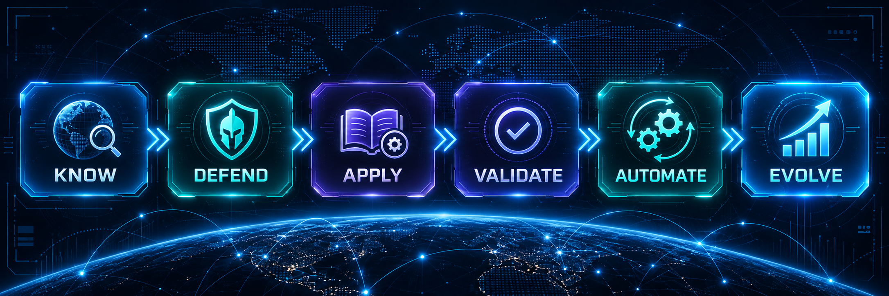

<!--
  CYBER-SENTINEL GitHub Profile
  Professional cyber-defense engineering ecosystem and product-family landing page.
-->

<p align="center">
  
</p>

<p align="center">
  <strong>Evidence-Driven Cyber Defense Engineering</strong>
</p>

<p align="center">
  Security Leadership • SOC & THIR • Detection Engineering • DFIR • Security Architecture • AppSec & DevSecOps • AI Security • Defensive Automation
</p>

---

# Cyber-Sentinel

**Cyber-Sentinel is a contract-separated cyber-defense product ecosystem for connecting trusted knowledge, defensive engineering, and governed operational execution.**

The ecosystem is designed for security teams that need more than disconnected repositories, opaque automation, or unverified AI output. Its operating model keeps provenance, engineering validation, execution safety, and product ownership explicit while allowing each layer to reinforce the others.

```text
Cyber-Sentinel
├── ATLAS       — KNOW   → Connect • Search • Investigate • Explain
├── DefenseOps  — DEFEND → Detect • Hunt • Validate • Respond • Automate
└── Skills      — APPLY  → Execute • Review • Reuse • Govern
```

The product thesis is simple:

> **Security knowledge should become defensible engineering; defensible engineering should become repeatable operating practice; operational outcomes should feed back into better knowledge and controls.**

## Why Cyber-Sentinel Exists

Modern security programs often suffer from fragmentation:

- investigation knowledge is distributed across vendor portals, internal documents, analyst memory, and threat frameworks;
- detections and hunts are copied without clear validation or deployment assumptions;
- runbooks vary between teams and experienced operators;
- automation can hide trust boundaries and evidence;
- AI-generated security output may be useful but insufficiently grounded or auditable.

Cyber-Sentinel addresses these problems through three explicit product layers with separate responsibilities and shared evidence discipline.

## Product Portfolio

| Product | Role | Current maturity | Primary value |
| --- | --- | --- | --- |
| [Cyber-Sentinel-Atlas](https://github.com/cyber-sentinel/Cyber-Sentinel-Atlas) | **KNOW** | **First Preview engineering readiness: READY**; Phase 5.10 Public Preview readiness **ACTIVE / BLOCKED** | Provenance-first knowledge, deterministic investigation, verified offline content, analyst workbench |
| [Cyber-Sentinel-DefenseOps](https://github.com/cyber-sentinel/Cyber-Sentinel-DefenseOps) | **DEFEND** | Stable engineering baseline `0.1.0`; no GitHub Release/tag currently published | Detection engineering, threat hunting, validation, DFIR/IR engineering, response and automation |
| [Cyber-Sentinel-Skills](https://github.com/cyber-sentinel/Cyber-Sentinel-Skills) | **APPLY** | Foundation / operating-model stage | Governed cybersecurity procedures and playbooks for humans and AI-assisted workflows |

Maturity labels are intentionally conservative. Public visibility, passing CI, or a successful preview build is not presented as GA or universal production readiness unless the corresponding release boundary has actually been closed.

## Enterprise Value

Cyber-Sentinel is intended to support security organizations that need:

- evidence-backed investigation and analyst context;
- repeatable Detection-as-Code and Hunt-as-Code engineering;
- clearer telemetry, validation, and rollback assumptions;
- auditable operating procedures across SOC, IR, DFIR, and engineering teams;
- offline-capable or restricted-environment security workflows;
- safer foundations for AI-assisted security operations;
- explicit separation between canonical knowledge, engineering artifacts, and execution procedures;
- reusable security content without hiding vendor or environment dependencies.

The ecosystem is relevant to SOC teams, security engineering organizations, blue/purple teams, incident-response functions, DFIR practitioners, threat hunters, security architects, platform teams, and security leaders building governed defensive capabilities.

---

# ATLAS — KNOW

## Provenance-First Cyber Defense Knowledge & Investigation Platform

ATLAS is the knowledge and investigation product of the ecosystem. It connects security telemetry, canonical records, adversary behavior, detections, threat hunts, DFIR artifacts, defensive context, relationships, and claim-level provenance into an inspectable analyst workflow.

**Core question:** *What do we know about what we are seeing — and what evidence supports it?*

### Current engineering state

```text
Phase 5.1  Product Foundation                 COMPLETE
Phase 5.2  Canonical Data Model              COMPLETE / MERGED
Phase 5.3  Source & Ingestion Core           COMPLETE / MERGED
Phase 5.4  Deterministic Search Core         COMPLETE / MERGED
Phase 5.5  Offline Pack / Shared Core        COMPLETE / MERGED / POST-MERGE VERIFIED / FROZEN
Phase 5.6  Windows Desktop MVP               COMPLETE / MERGED / POST-MERGE VERIFIED

FIRST PREVIEW READY — ENGINEERING READINESS

Phase 5.10 Public Preview Readiness           ACTIVE
  5.10.0 Readiness Baseline                  MERGED / POST-MERGE VERIFIED
Public Preview release                        BLOCKED
```

The First Preview package baseline is bound to `main@70afc6fdb9e5ce88afdb0dd4de139aa659606f1e` and post-merge package run `35133827422`. Phase 5.10.0 subsequently established machine-enforced Public Preview readiness controls without changing the frozen First Preview package evidence.

The First Preview is an engineering-ready, unsigned portable Windows artifact. Public Preview remains blocked by explicit release-readiness boundaries such as first-party licensing, third-party redistribution closure, production code signing/key custody, public packaging/distribution hardening, accessibility review, source-freshness policy, and launch governance.

### Accepted architecture

- canonical schema contract `1.0.0` using JSON Schema Draft 2020-12;
- exactly seven canonical `AtlasRecord` families;
- deterministic exact-before-lexical retrieval using SQLite + FTS5;
- TUF-based pack trust, trusted-time, and highest-seen rollback protection;
- verified `.atlaspack` runtime with immutable generations and Last Known Good semantics;
- production Shared Core implemented in Go;
- bounded child-process stdio IPC via `atlas-core --serve-stdio`;
- no default local HTTP/TCP/WebSocket listener and no hidden network fallback;
- Windows desktop host selected as Tauri 2.x through frozen, evidence-based evaluation;
- explicit command allowlists and CSP `connect-src 'none'`;
- adjacent SHA-256-bound `atlas-core.exe` sidecar with fail-closed integrity handling.

ATLAS remains intentionally **offline-first, evidence-first, and fail-closed**.

---

# DefenseOps — DEFEND

## Evidence-Driven Cyber Defense Engineering

DefenseOps is the defensive-engineering layer for reusable, testable, evidence-backed detections, hunts, validation assets, response content, DFIR/IR engineering material, deception-oriented controls, and security automation.

**Core question:** *What can we detect, validate, hunt, and defend — and what evidence supports that claim?*

The current repository baseline is `0.1.0`, documented as a stable engineering baseline in the changelog. It includes native Sigma, YARA, Suricata, Snort, and Zeek validation, positive/negative synthetic fixtures, and explicit quality maturity levels. No GitHub Release or tag is currently published for that baseline.

DefenseOps is deliberately production-conscious: telemetry prerequisites, false positives, engine/language specificity, validation maturity, rollback, reproducibility, and deployment constraints are treated as part of the engineering artifact rather than afterthoughts.

---

# Skills — APPLY

## Governed Cybersecurity Operational Skills & Playbooks

Skills is the reusable operating-procedure layer for cybersecurity work that should be explicit enough to execute consistently, review technically, attribute correctly, improve over time, and consume safely in human or AI-assisted workflows.

**Core question:** *How should this security task be performed consistently, safely, and verifiably?*

A Skill is treated as a governed execution contract rather than a command list. It should make scope, authorization, prerequisites, procedure, evidence, decision points, failure conditions, rollback/escalation, outputs, and attribution explicit.

The repository is currently in a foundation / operating-model stage. Its objective is not maximum playbook count; it is reliable operating knowledge that teams can trust, review, adapt, automate selectively, and govern.

---

# Ecosystem Operating Loop

<p align="center">
  
</p>

```text
Authoritative Sources / Telemetry / Security Knowledge
                         │
                         ▼
                  ATLAS — KNOW
        Connect • Search • Investigate • Explain
                         │
             evidence / defensive context
                         ▼
               DefenseOps — DEFEND
       Detect • Hunt • Validate • Respond • Automate
                         │
              repeatable operating method
                         ▼
                  Skills — APPLY
          Execute • Review • Reuse • Govern
                         │
                         ▼
          VALIDATE → AUTOMATE → EVOLVE
                         │
                         └──────────────↺
                    feedback into knowledge,
                 engineering and procedures
```

`VALIDATE`, `AUTOMATE`, and `EVOLVE` are operating outcomes and feedback stages, not separate repositories.

Controlled content may move between products, but trust is never inherited merely because another Cyber-Sentinel repository produced an artifact. Provenance, validation, versioning, authorization, and release boundaries remain explicit.

# Security & Trust Principles

- **No technical claim without provenance.**
- **Detection must be measurable and testable.**
- **Security controls must survive production reality.**
- **Automation should reduce analyst workload without hiding evidence or decision boundaries.**
- **Threat intelligence is valuable when it changes a defensive decision.**
- **Incident response should feed back into architecture, detection, and engineering.**
- **AI output in security should be grounded, inspectable, and governed.**
- **Canonical contracts should not drift for implementation convenience.**
- **Security engineering should be reproducible, documented, reviewable, and rollback-aware.**
- **Architecture decisions should follow executable evidence, not framework preference.**

# Commercial Maturity Discipline

Cyber-Sentinel uses explicit maturity boundaries rather than marketing shorthand:

- **Engineering ready** means the defined engineering and verification gates have passed.
- **Public preview ready** additionally requires release-specific licensing, signing, distribution, accessibility, governance, and publication evidence.
- **Production ready** is environment-specific and cannot be inferred from repository CI alone.
- **Public source visibility** does not grant reuse or redistribution rights when no project license has been published.

This distinction is intentional for security products: confidence should follow evidence, not branding.

# International / Enterprise Fit

The product family is being engineered around characteristics relevant to professional security environments:

- inspectable evidence and provenance;
- deterministic and offline-capable operation where required;
- explicit security boundaries and fail-closed behavior;
- vendor-aware but architecture-driven design;
- reproducible validation and CI evidence;
- separation of engineering readiness from release and deployment approval;
- compatibility with human-led and AI-assisted security workflows without collapsing accountability.

Cyber-Sentinel is therefore positioned as a serious cyber-defense engineering ecosystem for technical evaluation, collaboration, research, enterprise-oriented product development, and future controlled distribution — not as a collection of marketing demos.

# Professional Focus

Cyber-Sentinel reflects work across:

- Information Security Management and cyber-defense strategy;
- SOC and THIR operating models;
- Detection Engineering and threat hunting;
- Digital Forensics and Incident Response;
- security architecture and defense-in-depth;
- AppSec, SSDLC, and DevSecOps;
- security automation and orchestration;
- AI-assisted defensive workflows and grounded security knowledge systems.

### Security technologies and platforms

`Splunk` `Wazuh` `MISP` `Sigma` `YARA` `Sysmon` `Zeek` `Suricata` `SOAR` `CTI` `SentinelOne` `ESET Inspect` `FortiGate` `FortiWeb` `Palo Alto` `F5 BIG-IP` `PAM` `DLP` `IAM`

### Engineering technologies

`Go` `Python` `PowerShell` `Bash` `Rust` `Git/GitHub Actions` `SQLite/FTS5` `Tauri` `Docker` `Kubernetes` `REST APIs` `JSON` `YAML`

### Frameworks and standards

`MITRE ATT&CK` `MITRE D3FEND` `MITRE CAR` `NIST CSF` `NIST SP 800-61` `CIS Controls` `ISO/IEC 27001` `OWASP`

---

## Maintainer

**Ali RahimDabagh**

Information Security Manager • Cyber Defense Architect

---

<p align="center">
  <strong>Know. Defend. Apply. Evolve.</strong>
</p>

<p align="center">
  <sub>Cyber-Sentinel • Evidence-Driven Security Leadership & Cyber Defense Engineering</sub>
</p>
