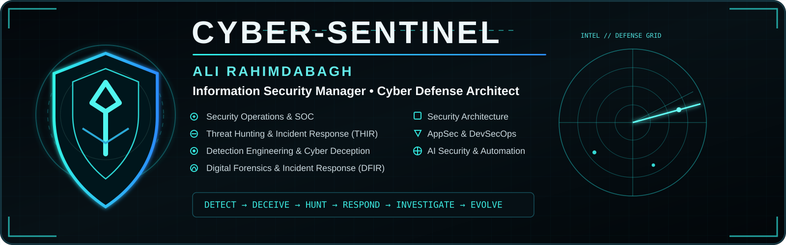

<!--
  CYBER-SENTINEL GitHub Profile
  Maintained as a professional cybersecurity portfolio.
-->

  

  <strong>Cyber Defense Architecture • SOC & THIR • Detection Engineering • Cyber Deception • EDR/XDR • DFIR • AppSec • DevSecOps • AI Security</strong>

  Building resilient security operations, engineering effective detections, and turning complex cyber risk into executable defense.

---

## About

I am a cybersecurity professional focused on designing and operating modern cyber defense capabilities across SOC, Threat Hunting, Incident Response, DFIR, Detection Engineering, Cyber Deception, EDR/XDR, Security Architecture, AppSec, DevSecOps, and AI-assisted security operations.

My work spans both hands-on engineering and security leadership: from telemetry design, detection logic, threat hunting, incident response, and security tooling to operating models, technical governance, architecture, and continuous security improvement.

I am especially interested in building security programs that are measurable, automatable, production-aware, and aligned with real operational risk.

---

## Core Competencies

- **SOC Architecture & Operations** — SIEM engineering, telemetry strategy, use-case lifecycle, tuning, triage, escalation, and SOC operating models
- **Threat Hunting & Intelligence** — hypothesis-driven hunting, ATT&CK mapping, CTI enrichment, IOC/TTP analysis, and hunt development
- **Detection Engineering** — Sigma, Splunk SPL, KQL, YARA, behavioral analytics, detection-as-code, validation, and false-positive reduction
- **Cyber Deception & Active Defense** — deception architecture, decoys, lures, breadcrumbs, canary assets, adversary engagement, and deception-driven detection
- **Endpoint Detection & Response (EDR/XDR)** — endpoint telemetry, behavioral detection, investigation, containment, response workflows, and detection tuning
- **Incident Response & THIR** — containment, eradication, root-cause analysis, playbooks, evidence handling, and post-incident improvement
- **Digital Forensics** — Windows/Linux artifacts, memory and disk analysis concepts, timelines, persistence, and attacker tradecraft
- **Security Architecture** — defense-in-depth, segmentation, IAM/PAM, WAF, endpoint, network security, logging, and secure design reviews
- **Application Security & DevSecOps** — SSDLC, SAST/DAST/SCA, secrets management, CI/CD controls, threat modeling, and secure release gates
- **AI & Security Automation** — AI-assisted SOC workflows, orchestration, enrichment, knowledge systems, and security automation

---

## Technology & Security Stack

### Security Operations
`Splunk` `Wazuh` `MISP` `Sigma` `YARA` `Sysmon` `Zeek` `Suricata` `SOAR` `Threat Intelligence`

### Network & Security Platforms
`FortiGate` `FortiWeb` `Palo Alto` `F5 BIG-IP` `Cisco` `WAF` `PAM` `DLP`

### Endpoint, EDR/XDR & Deception
`SentinelOne` `Kaspersky KATA / EDR` `ESET Inspect` `FortiDeceptor` `EDR/XDR` `Cyber Deception` `Canary / Decoy Technologies`

### Engineering & Automation
`Python` `PowerShell` `Bash` `Git` `Docker` `Kubernetes` `REST APIs` `JSON` `YAML`

### Frameworks & Standards
`MITRE ATT&CK` `NIST CSF` `NIST 800-61` `CIS Controls` `ISO/IEC 27001` `OWASP` `COBIT`

---

## Featured Security Projects

These repositories are being developed as a practical cybersecurity engineering portfolio:

| Project | Focus |
|---|---|
| **sentinel-forge** | Flagship cyber defense engineering lab and reusable security tooling |
| **detection-engineering-lab** | Sigma, Splunk, KQL, detection logic, validation, and tuning |
| **threat-hunting-lab** | Threat hunting scenarios, hypotheses, queries, and ATT&CK mappings |
| **soc-playbooks** | SOC runbooks, incident-response procedures, triage flows, and escalation models |
| **dfir-fieldbook** | DFIR references, artifacts, investigation notes, and field procedures |
| **ai-soc-lab** | AI-assisted SOC, LLM security experiments, automation, and enrichment workflows |

> Repositories are being built incrementally with a focus on technical quality, reproducibility, and real-world defensive value.

---

## Current Focus

- Detection-as-Code and detection validation
- Cyber Deception and active-defense engineering
- EDR/XDR telemetry, investigation, response, and tuning
- Advanced Threat Hunting
- SOC and THIR operating models
- DFIR and incident-response engineering
- CTI integration and enrichment
- AppSec / DevSecOps security gates
- AI-assisted security operations
- Security architecture for resilient enterprise environments

---

## Engineering Principles

- **Detection must be measurable.**
- **Security controls must survive production reality.**
- **Automation should reduce analyst workload, not hide complexity.**
- **Threat intelligence is useful only when it changes a defensive decision.**
- **Incident response must feed back into architecture and detection.**
- **Security engineering should be reproducible, documented, and testable.**

---

## GitHub Roadmap

This profile is being developed around six core pillars:

`Detect` → `Deceive` → `Hunt` → `Respond` → `Investigate` → `Engineer` → `Automate`

The long-term goal is to maintain a high-signal repository of practical cyber defense content, tools, detections, playbooks, labs, and security research.

---

  <strong>Detect. Defend. Respond. Evolve.</strong>

  Cyber-Sentinel • Cyber Defense Engineering Portfolio

