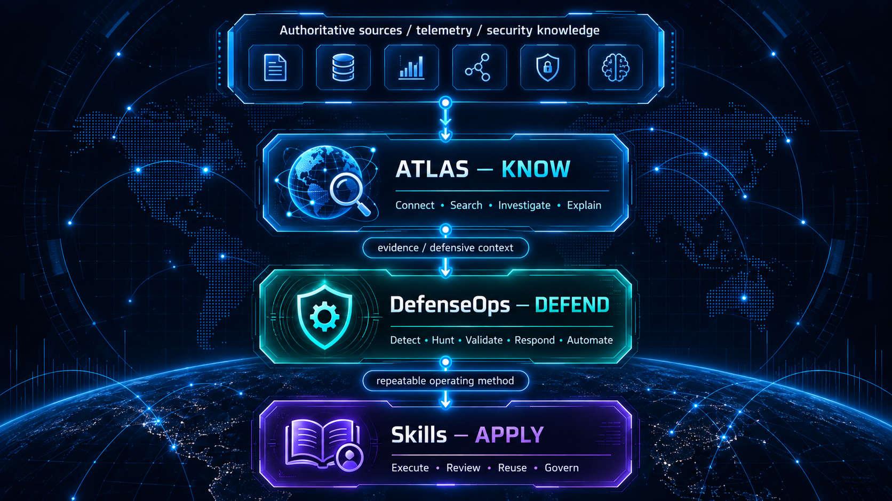

<!--
  CYBER-SENTINEL GitHub Profile
  Maintained as a professional cybersecurity engineering portfolio and ecosystem landing page.
-->

<p align="center">
  
</p>

<p align="center">
  <strong>Information Security Manager • Cyber Defense Architect</strong>
</p>

<p align="center">
  Security Operations & SOC • Threat Hunting & Incident Response • Detection Engineering • DFIR • Security Architecture • AppSec & DevSecOps • AI Security & Automation
</p>

---

## About

I am an **Information Security Manager and Cyber Defense Architect** with 15+ years of experience across cybersecurity engineering, security operations, incident response, threat hunting, digital forensics, security architecture, and security leadership.

My work sits at the intersection of **security leadership, cyber defense architecture, and hands-on engineering**. I design and mature security programs, build SOC/THIR capabilities, engineer detections and investigation workflows, develop defensive automation, and turn security knowledge into systems that can be tested, governed, and operated in real environments.

**Cyber-Sentinel** is where I develop that work as a connected ecosystem rather than a collection of unrelated repositories.

---

## Cyber-Sentinel Ecosystem

Cyber-Sentinel follows a contract-separated operating model:

<p align="center">
  
</p>

```text
Cyber-Sentinel
├── ATLAS       — KNOW   → Connect • Search • Investigate • Explain
├── DefenseOps  — DEFEND → Detect • Hunt • Validate • Respond • Automate
└── Skills      — APPLY  → Execute • Review • Reuse • Govern
```

The objective is not repository count. The objective is a coherent cyber-defense engineering system in which **knowledge, evidence, detections, investigations, procedures, validation and automation reinforce each other without collapsing their trust boundaries**.

### Cyber-Sentinel-Atlas — KNOW

**Provenance-First Cyber Defense Knowledge & Investigation Platform**

**Repository state:** Public source repository • Pre-preview / unreleased

ATLAS is the knowledge and investigation product of the ecosystem. It connects security telemetry, adversary behavior, ATT&CK/D3FEND/CAR context, detections, threat hunts, DFIR artifacts, investigation guidance, defensive controls, and claim-level provenance into an inspectable analyst workflow.

Its foundation is intentionally **offline-first, Windows-first and evidence-first**:

- governed canonical security records and relationships;
- deterministic exact-before-lexical retrieval;
- SQLite + FTS5 search;
- source and claim-level provenance;
- verified offline content packs;
- TUF-based pack trust and rollback protection;
- Go production Shared Core;
- bounded local `atlas-core --serve-stdio` protocol;
- no default local HTTP/TCP/WebSocket listener or hidden network fallback.

Current engineering status:

```text
Phase 5.1  Product Foundation                 COMPLETE
Phase 5.2  Canonical Data Model              COMPLETE
Phase 5.3  Source & Ingestion Core           COMPLETE
Phase 5.4  Deterministic Search Core         COMPLETE
Phase 5.5  Offline Pack / Shared Core        COMPLETE / MERGED / VERIFIED / FROZEN
Phase 5.6  Windows Desktop MVP               IN PROGRESS
  5.6.0   Environment / Core Boundary       COMPLETE / VERIFIED
  5.6.1   Executable Candidate Builds       COMPLETE / VERIFIED
  5.6.2   Hard Gates / Desktop Selection    IN PROGRESS
           G-D5 Active Pack Integration     COMPLETE / VERIFIED
           G-D6 Update / Safe Rollback      IN PROGRESS
  5.6.3   First Preview UI                  PLANNED
  5.6.4   Packaging / Smoke Closure         PLANNED
```

The executable Windows baseline is green across **Tauri, Electron and .NET/WPF**, all consuming the same production Shared Core. No Desktop framework has been selected yet. Electron has a committed dependency lockfile; Tauri still requires committed `Cargo.lock` closure before final reproducibility evidence is complete.

The signed-pack Active Generation integration gate is now green: production `atlas-core` can load a verified Active Generation into canonical, immutable search and graph read models while malformed/unsafe durable state remains fail-closed. **G-D5 is closed.**

The active engineering boundary is **G-D6: core-owned verified pack update and safe manual rollback**. Desktop security review, UDP/no-listener closure, installer/portable feasibility, remaining measurements, and ADR-0026 follow before Phase 5.6.3 can start.

The First Preview remains centered on offline search, canonical record detail, relationship navigation, claim-level provenance, Windows/Sysmon-oriented investigation context, verified pack state, update, safe rollback, and Windows packaging.

The UI direction is intentionally operational rather than promotional: dense dark analyst surfaces, restrained theme switching, validated geographic assets, and security-state colors with stable semantics. Generated maps are not treated as product geography.

**Core question:** *What do we know about what we are seeing?*

### Cyber-Sentinel-DefenseOps — DEFEND

**Open Cyber Defense Operations Engineering**

**Repository state:** Private development

DefenseOps is the defensive engineering layer: reusable and testable detections, hunting content, validation assets, response engineering, DFIR/IR material, deception-oriented content, and automation designed for operational use.

It emphasizes explicit telemetry prerequisites, engine-aware implementation, validation maturity, production considerations, rollback, and reproducibility rather than simply accumulating rules.

DefenseOps can provide controlled defensive content to ATLAS, but repository origin alone never grants canonical authority. ATLAS retains its own ingestion, provenance, validation, promotion and release boundaries.

**Core question:** *What can we detect, validate, hunt, and defend?*

### [Cyber-Sentinel-Skills](https://github.com/cyber-sentinel/Cyber-Sentinel-Skills) — APPLY

**Vendor-neutral Cybersecurity Operational Skills & Playbooks**

**Repository state:** Public

Skills is the reusable operational procedure layer for cybersecurity tasks that can be followed by both humans and AI agents. The goal is to make security work explicit, reviewable, attributable, repeatable, and governable without allowing uncontrolled contributions to redefine product direction.

Skills does not replace ATLAS product contracts or DefenseOps engineering artifacts. It captures the repeatable operating method used to apply them consistently.

**Core question:** *How should this security task be performed consistently?*

---

## Ecosystem Operating Loop

<p align="center">
  
</p>

`VALIDATE`, `AUTOMATE`, and `EVOLVE` are ecosystem operating outcomes and feedback stages rather than separate repositories.

---

## How the Projects Relate

The repositories intentionally remain separate:

<p align="center">
  
</p>

- **ATLAS owns knowledge, canonical context, deterministic retrieval, provenance and analyst investigation surfaces.**
- **DefenseOps owns defensive engineering content and validation-oriented operational artifacts.**
- **Skills owns reusable procedures and playbooks for consistent execution.**

Controlled content may flow between projects, but trust is never inherited merely because another Cyber-Sentinel repository produced an artifact. Provenance, validation, versioning and release boundaries remain explicit.

---

## Core Competencies

### Security Leadership & Architecture

- Information Security Management, strategy, governance, risk-based prioritization, security roadmaps, KPI/KRI and program maturity
- SOC & THIR operating models, escalation, incident governance, threat hunting and continuous improvement
- Security architecture, defense-in-depth, IAM/PAM, segmentation, resilient design and production-aware control engineering

### Cyber Defense Engineering

- **Security Operations & SOC:** SIEM engineering, telemetry strategy, use-case lifecycle, tuning and triage
- **Threat Hunting & Incident Response:** hypothesis-driven hunting, ATT&CK mapping, containment, eradication and lessons learned
- **Detection Engineering:** Detection-as-Code, Sigma, Splunk SPL, Microsoft KQL, Elastic KQL/EQL/ES|QL, YARA, Suricata and behavioral analytics
- **DFIR:** Windows/Linux artifacts, timelines, persistence analysis, evidence handling and investigation workflows
- **AppSec & DevSecOps:** SSDLC, SAST/DAST/SCA, secrets management, CI/CD security gates and threat modeling
- **AI Security & Automation:** AI-assisted SOC workflows, enrichment, orchestration, grounded knowledge systems and defensive automation

---

## Technology & Security Stack

### SIEM, Detection, NSM & Threat Intelligence

`Splunk` `Wazuh` `MISP` `Sigma` `YARA` `Sysmon` `Zeek` `Suricata` `SOAR` `CTI`

### Endpoint / EDR / XDR

`SentinelOne` `Kaspersky KATA/KEDR` `ESET Inspect` `EDR` `XDR` `Endpoint Telemetry`

### Network, Application & Access Security

`FortiGate` `FortiWeb` `Palo Alto` `F5 BIG-IP` `Cisco` `WAF` `PAM` `DLP` `IAM`

### Engineering & Platforms

`Go` `Python` `PowerShell` `Bash` `Rust` `Git/GitHub Actions` `SQLite/FTS5` `Docker` `Kubernetes` `REST APIs` `JSON` `YAML`

### Frameworks & Standards

`MITRE ATT&CK` `MITRE D3FEND` `MITRE CAR` `NIST CSF` `NIST SP 800-61` `CIS Controls` `ISO/IEC 27001` `OWASP`

---

## Engineering Principles

- **No technical claim without provenance.**
- **Detection must be measurable and testable.**
- **Security controls must survive production reality.**
- **Automation should reduce analyst workload without hiding evidence or decision boundaries.**
- **Threat intelligence is useful when it changes a defensive decision.**
- **Incident response must feed back into architecture, detection, and engineering.**
- **AI output in security should be grounded, inspectable, and governed.**
- **Canonical contracts should not drift merely to satisfy implementation convenience.**
- **Security engineering should be reproducible, documented, reviewable and rollback-aware.**
- **Architecture selection should follow executable evidence, not framework preference.**

---

## Current Direction

The current engineering priority is to close **ATLAS Phase 5.6.2** without weakening the contracts already established by its canonical model, deterministic search, verified-pack runtime and Shared Core.

The immediate sequence is:

```text
G-D6  Verified Pack Update + Safe Manual Rollback
  ↓
G-D3  UDP/no-default-listener closure + G-D7 Desktop Security
  ↓
G-D8  Installer / Portable feasibility
  ↓
G-D9  Measurement closure + reproducibility gaps
  ↓
ADR-0026  Select one eligible Windows host
  ↓
Phase 5.6.3  First Preview UI
  ↓
Phase 5.6.4  Packaging + clean-machine smoke closure
```

Broader Web/PWA, Grounded AI, semantic/vector retrieval, cloud synchronization and expanded platform support remain deliberately secondary to completing a trustworthy offline Windows critical path first.

The longer-term Cyber-Sentinel objective remains a connected defensive ecosystem in which knowledge can become engineering, engineering can become repeatable operating practice, and operational results can feed back into better knowledge and controls.

---

<p align="center">
  <strong>Know. Defend. Apply. Evolve.</strong>
</p>

<p align="center">
  <sub>Cyber-Sentinel • Security Leadership & Cyber Defense Engineering</sub>
</p>

---

**Maintainer:** Ali RahimDabagh

**GitHub:** `cyber-sentinel`
