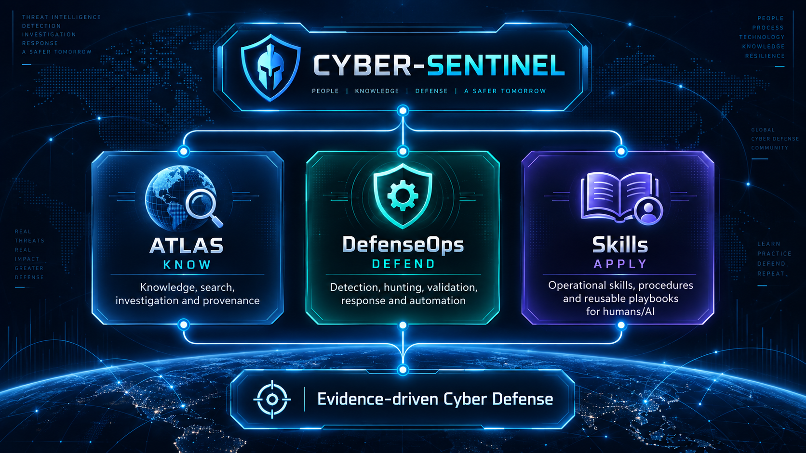

<!--
  CYBER-SENTINEL GitHub Profile
  Maintained as a professional cybersecurity engineering portfolio.
-->

<p align="center">
  
</p>

<p align="center">
  <strong>Information Security Manager • Cyber Defense Architect</strong>
</p>

<p align="center">
  Security Operations & SOC • Threat Hunting & Incident Response (THIR) • Detection Engineering • DFIR • Security Architecture • AppSec & DevSecOps • AI Security & Automation
</p>

---

## About

I am an **Information Security Manager and Cyber Defense Architect** with 15+ years of experience across cybersecurity engineering, security operations, incident response, threat hunting, digital forensics, security architecture, and security leadership.

My work sits at the intersection of **security leadership, cyber defense architecture, and hands-on engineering**. I design and mature security programs, build SOC/THIR capabilities, engineer detections and investigation workflows, develop defensive automation, and turn security knowledge into systems that can be tested, governed, and operated in real environments.

Cyber-Sentinel is where I develop that work as a connected ecosystem rather than a collection of unrelated repositories.

---

## Cyber-Sentinel Ecosystem

The ecosystem follows a simple operational model:

<p align="center">
  
</p>

### [Cyber-Sentinel-Atlas](https://github.com/cyber-sentinel/Cyber-Sentinel-Atlas) — KNOW

**Intelligent Cyber Defense Knowledge & Investigation Platform**

Atlas is the signature product of the ecosystem. It is being engineered as a vendor-neutral, analyst-first platform that connects security telemetry, adversary behavior, ATT&CK/D3FEND/CAR context, detections, threat hunts, DFIR artifacts, investigation guidance, defensive controls, and claim-level provenance.

Its architecture is built around a governed canonical data model, deterministic ingestion and search, offline packs and shared runtime components, desktop/web interfaces, API/CLI access, and ultimately source-grounded AI assistance.

**Core question:** *What do we know about what we are seeing?*

> Atlas is under active private development. It is no longer a planned concept; architecture, canonical modeling, ingestion, search, offline/runtime engineering, CI governance, and subsequent delivery phases are being implemented incrementally with evidence-backed gates.

### [Cyber-Sentinel-DefenseOps](https://github.com/cyber-sentinel/Cyber-Sentinel-DefenseOps) — DEFEND

**Open Cyber Defense Operations Engineering**

DefenseOps is the defensive engineering core: reusable and testable detections, hunting content, validation assets, response engineering, DFIR/IR material, deception-oriented content, and automation designed for operational use.

It emphasizes explicit telemetry prerequisites, engine-aware implementation, validation maturity, production considerations, rollback, and reproducibility rather than simply accumulating rules.

**Core question:** *What can we detect, validate, hunt, and defend?*

### [Cyber-Sentinel-Skills](https://github.com/cyber-sentinel/Cyber-Sentinel-Skills) — APPLY

**Vendor-neutral Cybersecurity Operational Skills & Playbooks**

Skills is the operational knowledge layer for reusable cybersecurity procedures that can be followed by both humans and AI agents. The goal is to make security tasks explicit, reviewable, attributable, and repeatable while keeping contribution governance strong enough to protect technical quality and project direction.

**Core question:** *How should this security task be performed consistently?*

---

## How the Projects Relate

The repositories have distinct responsibilities and are intentionally not collapsed into one product:

```text
Authoritative sources / telemetry / security knowledge
                         │
                         ▼
                  ATLAS — KNOW
        Connect • Search • Investigate • Explain
                         │
             evidence / defensive context
                         ▼
               DefenseOps — DEFEND
       Detect • Hunt • Validate • Respond • Automate
                         │
              repeatable operating method
                         ▼
                  Skills — APPLY
          Execute • Review • Reuse • Govern
```

DefenseOps can provide controlled, validated defensive content to Atlas, but repository origin alone does not grant canonical authority. Atlas preserves its own ingestion, provenance, validation, promotion, and release boundaries. Skills remains an operational procedure/playbook layer rather than a substitute for either Atlas product contracts or DefenseOps engineering content.

---

## Core Competencies

### Security Leadership & Architecture
- Information Security Management, strategy, governance, risk-based prioritization, security roadmaps, KPI/KRI and program maturity
- SOC & THIR operating models, escalation, incident governance, threat hunting and continuous improvement
- Security architecture, defense-in-depth, IAM/PAM, segmentation, resilient design and production-aware control engineering

### Cyber Defense Engineering
- **Security Operations & SOC:** SIEM engineering, telemetry strategy, use-case lifecycle, tuning and triage
- **Threat Hunting & Incident Response:** hypothesis-driven hunting, ATT&CK mapping, containment, eradication and lessons learned
- **Detection Engineering:** Detection-as-Code, Sigma, Splunk SPL, Microsoft KQL, Elastic KQL/EQL/ES|QL, YARA, Suricata and behavioral analytics
- **DFIR:** Windows/Linux artifacts, timelines, persistence analysis, evidence handling and investigation workflows
- **AppSec & DevSecOps:** SSDLC, SAST/DAST/SCA, secrets management, CI/CD security gates and threat modeling
- **AI Security & Automation:** AI-assisted SOC workflows, enrichment, orchestration, grounded knowledge systems and defensive automation

---

## Technology & Security Stack

### SIEM, Detection, NSM & Threat Intelligence
`Splunk` `Wazuh` `MISP` `Sigma` `YARA` `Sysmon` `Zeek` `Suricata` `SOAR` `CTI`

### Endpoint / EDR / XDR
`SentinelOne` `Kaspersky KATA/KEDR` `ESET Inspect` `EDR` `XDR` `Endpoint Telemetry`

### Network, Application & Access Security
`FortiGate` `FortiWeb` `Palo Alto` `F5 BIG-IP` `Cisco` `WAF` `PAM` `DLP` `IAM`

### Engineering & Platforms
`Python` `PowerShell` `Bash` `Rust` `Git/GitHub Actions` `Docker` `Kubernetes` `REST APIs` `JSON` `YAML`

### Frameworks & Standards
`MITRE ATT&CK` `MITRE D3FEND` `MITRE CAR` `NIST CSF` `NIST SP 800-61` `CIS Controls` `ISO/IEC 27001` `OWASP`

---

## Engineering Principles

- **No technical claim without provenance.**
- **Detection must be measurable and testable.**
- **Security controls must survive production reality.**
- **Automation should reduce analyst workload without hiding evidence or decision boundaries.**
- **Threat intelligence is useful when it changes a defensive decision.**
- **Incident response must feed back into architecture, detection, and engineering.**
- **AI output in security should be grounded, inspectable, and governed.**
- **Canonical contracts should not drift merely to satisfy implementation convenience.**
- **Security engineering should be reproducible, documented, reviewable, and rollback-aware.**

---

## Current Direction

Cyber-Sentinel is being developed toward an integrated but contract-separated cyber defense ecosystem:

`KNOW → DEFEND → APPLY → VALIDATE → AUTOMATE → EVOLVE`

The objective is not repository count. The objective is a high-signal body of security engineering in which knowledge, evidence, detections, investigations, procedures, validation, and automation can reinforce each other without sacrificing provenance or architectural boundaries.

---

<p align="center">
  <strong>Know. Defend. Apply. Evolve.</strong>
</p>

<p align="center">
  <sub>Cyber-Sentinel • Security Leadership & Cyber Defense Engineering</sub>
</p>

---

**Maintainer:** Ali RahimDabagh  
**GitHub:** `cyber-sentinel`
