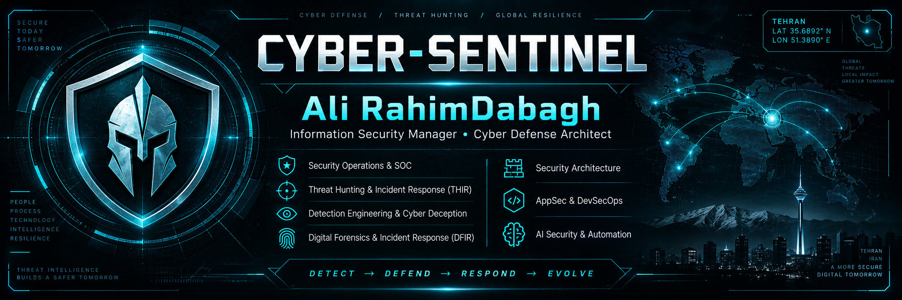

<!--
  CYBER-SENTINEL GitHub Profile
  Maintained as a professional cybersecurity portfolio.
-->

  

  <strong>Information Security Manager • Cyber Defense Architect</strong>

  Security Operations & SOC • Threat Hunting & Incident Response (THIR) • Detection Engineering & Cyber Deception • Digital Forensics & Incident Response (DFIR) • Security Architecture • AppSec & DevSecOps • AI Security & Automation

---

## About

I am an **Information Security Manager and Cyber Defense Architect** with 15+ years of experience across cybersecurity engineering, security operations, incident response, threat hunting, digital forensics, security architecture, and security leadership.

My work combines **information security management, cyber defense architecture, and hands-on security engineering**. I design and mature security programs, build and operate SOC/THIR capabilities, lead incident-response and threat-hunting activities, engineer detections, develop cyber-deception strategies, and integrate defensive technologies into measurable security operations.

I focus on converting cyber risk into practical controls, operating models, detection logic, response procedures, and engineering roadmaps that remain effective in real production environments.

---

## Core Competencies

### Security Leadership & Management
- **Information Security Management** — security strategy, governance, risk-based prioritization, security roadmaps, KPI/KRI, stakeholder alignment, and security program maturity
- **SOC & THIR Leadership** — SOC operating models, team structure, escalation paths, incident governance, threat-hunting programs, and continuous operational improvement
- **Security Architecture & Engineering Leadership** — architecture reviews, defense-in-depth, control selection, technology evaluation, and production-aware security design

### Cyber Defense Specializations
- **Security Operations & SOC** — SIEM engineering, telemetry strategy, use-case lifecycle, tuning, triage, escalation, and security monitoring
- **Threat Hunting & Incident Response (THIR)** — hypothesis-driven hunting, ATT&CK mapping, containment, eradication, root-cause analysis, playbooks, and post-incident improvement
- **Detection Engineering & Cyber Deception** — detection-as-code, Sigma/SPL/KQL/YARA, behavioral analytics, validation, decoys, lures, breadcrumbs, canary assets, and deception-driven detection
- **Digital Forensics & Incident Response (DFIR)** — Windows/Linux artifacts, memory and disk analysis concepts, timelines, persistence analysis, evidence handling, and forensic investigation workflows
- **Security Architecture** — segmentation, IAM/PAM, endpoint and network security, WAF, logging architecture, resilient design, and security control integration
- **AppSec & DevSecOps** — SSDLC, SAST/DAST/SCA, secrets management, CI/CD security gates, threat modeling, and secure release processes
- **AI Security & Automation** — AI-assisted SOC workflows, security orchestration, enrichment, knowledge systems, LLM-security concepts, and automation

---

## Technology & Security Stack

> Technologies below represent platforms and tooling. They are intentionally separated from professional security domains and competencies.

### SIEM, SOC, Detection & Threat Intelligence
`Splunk` `Wazuh` `MISP` `Sigma` `YARA` `Sysmon` `Zeek` `Suricata` `SOAR` `CTI`

### Endpoint Security, EDR/XDR & Advanced Detection
`SentinelOne Singularity Endpoint` `Kaspersky KATA / KEDR` `ESET Inspect (EDR/XDR)` `EDR` `XDR` `Endpoint Telemetry`

### Cyber Deception & Active Defense
`FortiDeceptor` `SentinelOne Singularity Hologram` `Canary Technologies` `Decoys` `Lures` `Breadcrumbs`

### Network, Application & Access Security
`FortiGate` `FortiWeb` `Palo Alto` `F5 BIG-IP` `Cisco` `WAF` `PAM` `DLP` `IAM`

### Engineering, Automation & Platforms
`Python` `PowerShell` `Bash` `Git` `Docker` `Kubernetes` `REST APIs` `JSON` `YAML`

### Frameworks & Standards
`MITRE ATT&CK` `NIST CSF` `NIST SP 800-61` `CIS Controls` `ISO/IEC 27001` `OWASP` `COBIT`

---

## Featured Security Projects

These repositories are being developed as a practical cybersecurity engineering portfolio:

| Project | Focus |
|---|---|
| **sentinel-forge** | Flagship cyber defense engineering lab and reusable security tooling |
| **detection-engineering-lab** | Sigma, Splunk, KQL, detection logic, validation, and tuning |
| **cyber-deception-lab** | Deception architectures, decoys, lures, active-defense patterns, and deception-driven detections |
| **threat-hunting-lab** | Threat hunting scenarios, hypotheses, queries, and ATT&CK mappings |
| **soc-playbooks** | SOC runbooks, incident-response procedures, triage flows, and escalation models |
| **dfir-fieldbook** | DFIR references, artifacts, investigation notes, and field procedures |
| **ai-soc-lab** | AI-assisted SOC, LLM security experiments, automation, and enrichment workflows |

> Repositories are being built incrementally with a focus on technical quality, reproducibility, and real-world defensive value.

---

## Current Focus

- Information Security Management and security-program maturity
- SOC / THIR architecture, operating models, and measurable security operations
- Detection-as-Code and detection validation
- Threat Hunting & Incident Response (THIR)
- Digital Forensics & Incident Response (DFIR)
- Detection Engineering and Cyber Deception
- CTI integration and intelligence-driven detection
- AppSec / DevSecOps security engineering
- AI-assisted security operations and automation
- Enterprise security architecture and cyber resilience

---

## Engineering Principles

- **Detection must be measurable.**
- **Security controls must survive production reality.**
- **Automation should reduce analyst workload, not hide complexity.**
- **Threat intelligence is useful only when it changes a defensive decision.**
- **Incident response must feed back into architecture and detection.**
- **Security engineering should be reproducible, documented, and testable.**

---

## GitHub Roadmap

This profile is being developed around six core pillars:

`Detect` → `Deceive` → `Hunt` → `Respond` → `Investigate` → `Engineer` → `Automate`

The long-term goal is to maintain a high-signal repository of practical cyber defense content, tools, detections, playbooks, labs, and security research.

---

  <strong>Detect. Defend. Respond. Evolve.</strong>

  Cyber-Sentinel • Security Leadership & Cyber Defense Engineering Portfolio

