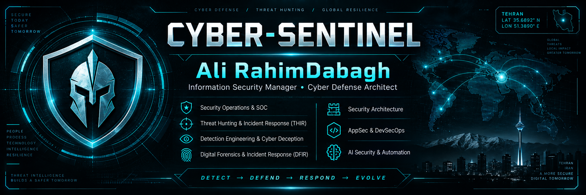
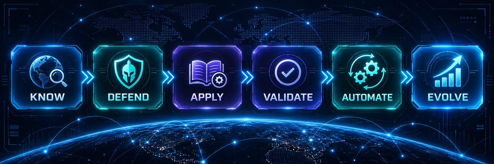

<!--
  CYBER-SENTINEL
  Public ecosystem landing page.
  Maintained as a concise portfolio view; product repositories remain authoritative for implementation state.
-->

<p align="center">
  
</p>

<p align="center">
  <strong>KNOW • DEFEND • APPLY • EVOLVE</strong>
</p>

<p align="center">
  Provenance-First Knowledge • Detection Engineering • Threat Hunting • DFIR • Defensive Validation • Security Automation • Governed Operational Skills
</p>

---

# Cyber-Sentinel

**Cyber-Sentinel is an evidence-driven cyber-defense engineering ecosystem designed to turn trusted security knowledge into validated defensive engineering and repeatable operating practice.**

The portfolio is intentionally split into distinct product contracts rather than a collection of overlapping repositories:

```text
Cyber-Sentinel
│
├── ATLAS       — KNOW
│   Connect • Search • Investigate • Explain
│
├── DefenseOps  — DEFEND
│   Detect • Hunt • Validate • Respond • Automate
│
└── Skills      — APPLY
    Execute • Review • Reuse • Govern

                 ↓
       VALIDATE • AUTOMATE • EVOLVE
                 ↺
```

> **Product thesis:** Security knowledge should become defensible engineering; defensible engineering should become repeatable operating practice; operational outcomes should feed back into better knowledge, detections, controls, and procedures.

## Product Portfolio

| Product | Mission | Current maturity | Primary value |
| --- | --- | --- | --- |
| [Cyber-Sentinel ATLAS](https://github.com/cyber-sentinel/Cyber-Sentinel-Atlas) | **KNOW** | Windows First Preview engineering-ready; Public Preview remains fail-closed | Provenance-first knowledge, deterministic retrieval, investigation, relationships, verified offline packs |
| [Cyber-Sentinel DefenseOps](https://github.com/cyber-sentinel/Cyber-Sentinel-DefenseOps) | **DEFEND** | Stable engineering baseline `0.1.0` | Detection engineering, hunting, validation, DFIR/IR engineering, response and automation |
| [Cyber-Sentinel Skills](https://github.com/cyber-sentinel/Cyber-Sentinel-Skills) | **APPLY** | Foundation under controlled review | Governed operational procedures and reusable cybersecurity playbooks |

Public repository visibility, passing CI or an engineering preview is not presented as GA or universal production readiness unless the corresponding release, security, legal and operational gates are closed.

---

# ATLAS — KNOW

## Provenance-First Cyber Defense Knowledge & Investigation Platform

ATLAS is the knowledge and investigation layer of Cyber-Sentinel.

Its core question is:

> **What do we know about what we are seeing — and what evidence supports it?**

ATLAS connects telemetry, canonical security records, adversary behavior, defensive context, investigation pivots, detections, hunts, DFIR artifacts, relationships and claim-level provenance into one analyst workflow.

### Current reviewed state

- First Preview engineering readiness: **READY**;
- Public Preview: **BLOCKED / fail-closed** until all mandatory release gates pass;
- canonical schema: `1.0.0`, exactly seven `AtlasRecord` families;
- deterministic exact-before-lexical retrieval: SQLite + FTS5;
- verified `.atlaspack` trust model with TUF, trusted-time and anti-rollback controls;
- production Shared Core: Go;
- Desktop host: Tauri 2.x over bounded child-process stdio;
- no default local HTTP/TCP/WebSocket listener;
- Windows Security Auditing: **8/423 encyclopedia-grade**, `415` remaining;
- current Windows Security exemplars: `4624`, `4625`, `4648`, `4672`, `4688`, `4740`, `4768`, `4771`;
- Sysmon 15.22: **30/30 encyclopedia-grade COMPLETE**;
- global Windows denominator: intentionally **not frozen** while additional mandatory telemetry families are still being controlled.

The machine-readable coverage ledger in the ATLAS repository is authoritative when a prose projection and repository state ever differ.

### Approved ATLAS delivery family

```text
ATLAS
│
├── Desktop
│    ├── Windows       ← current release-critical surface
│    ├── Linux
│    └── macOS
│
├── CLI
│    ├── Windows
│    ├── Linux
│    └── macOS
│
├── Web
├── PWA
│    └── iOS Safari
├── API
└── Mobile
     ├── iOS
     └── Android
```

Only the Windows Desktop surface is currently engineering-ready. The remaining surfaces are approved delivery scope, not release claims.

### ATLAS operating model

```text
Authoritative Sources
        ↓
Acquisition + Immutable Snapshot
        ↓
Normalization + Lineage
        ↓
Canonical Records
        ↓
Claims + Provenance
        ↓
Deterministic Search + Relationships
        ↓
Verified .atlaspack
        ↓
Analyst Investigation
        ↓
Evidence-backed defensive context
```

---

# DefenseOps — DEFEND

## Evidence-Driven Cyber Defense Engineering

DefenseOps owns the engineering lifecycle around defensive content.

Its core question is:

> **What can we detect, validate, hunt, and defend — and what evidence supports that claim?**

DefenseOps is organized around production-conscious engineering for:

- Detection-as-Code;
- Hunt-as-Code;
- multi-engine defensive validation;
- synthetic positive and negative fixtures;
- telemetry prerequisites and engine identity;
- false-positive and blind-spot analysis;
- DFIR/IR engineering content;
- response engineering;
- cyber-deception assets;
- rollback-aware defensive automation.

The current stable engineering baseline is `0.1.0`. Validation coverage includes Sigma, YARA, Suricata, Snort, Zeek and multiple SIEM/EDR query families where technically applicable.

A syntactically valid rule is not treated as automatically production-safe.

---

# Skills — APPLY

## Governed Cybersecurity Operational Skills & Playbooks

Skills owns reusable operating methods.

Its core question is:

> **How should this security task be performed consistently, safely, and verifiably?**

A substantive Skill is expected to define purpose, scope, authorization, prerequisites, inputs, procedure, decision points, evidence, failure/exit conditions, rollback, outputs, references and version history.

The current Foundation work is under controlled review. Repository governance and release authority remain explicit and independent from implementation completeness.

---

# Ecosystem Operating Loop

<p align="center">
  
</p>

```text
Authoritative Sources / Telemetry / Security Knowledge
                         │
                         ▼
                  ATLAS — KNOW
        Connect • Search • Investigate • Explain
                         │
             evidence / defensive context
                         ▼
               DefenseOps — DEFEND
       Detect • Hunt • Validate • Respond • Automate
                         │
              repeatable operating method
                         ▼
                  Skills — APPLY
          Execute • Review • Reuse • Govern
                         │
                         ▼
          VALIDATE → AUTOMATE → EVOLVE
                         │
                         └──────────────↺
                    feedback into knowledge,
                 engineering and procedures
```

Trust is not inherited merely because another Cyber-Sentinel repository produced an artifact. Provenance, validation, versioning, authorization and release boundaries remain explicit at every product boundary.

---

# Engineering & Trust Principles

1. **No technical claim without provenance.**
2. **Deterministic retrieval precedes optional semantic augmentation.**
3. **Detection and defensive content must be measurable and testable.**
4. **Automation must not hide evidence or decision boundaries.**
5. **Security controls must survive production reality.**
6. **Offline and restricted environments are first-class design conditions where relevant.**
7. **Canonical contracts do not drift for implementation convenience.**
8. **Trust, signing, update, rollback and release boundaries are explicit.**
9. **Human accountability remains intact in assisted operations.**
10. **Product maturity follows executable evidence, not marketing language.**

---

# Enterprise / International Product Direction

Cyber-Sentinel is engineered for professional security environments that value:

- SOC and THIR investigation consistency;
- deterministic, evidence-backed analyst workflows;
- Detection Engineering and Threat Hunting at scale;
- DFIR and incident-driven defensive improvement;
- restricted and offline operational environments;
- defensible provenance and version lineage;
- security-content supply-chain controls;
- product-level release discipline;
- cross-platform delivery without duplicating canonical truth;
- governed automation grounded in verifiable security context.

Target users include SOC analysts, incident responders, threat hunters, DFIR practitioners, detection/security engineers, purple teams, security architects, platform/security engineering teams and security leaders building governed cyber-defense capabilities.

---

# Product Maturity Model

| State | Meaning |
| --- | --- |
| **Foundation** | Product model and governance are established; broad operational coverage is still forming |
| **Engineering Ready** | Defined implementation and engineering verification gates have passed |
| **Public Preview Ready** | Release-specific licensing, redistribution, signing, packaging, accessibility, security and publication gates have passed |
| **Production Deployment** | Environment-specific approval after organization/customer validation and change control |

---

# Current Delivery Priorities

```text
ATLAS Windows Public Preview closure
        ↓
ATLAS Windows Security Corpus expansion
        ↓
ATLAS CLI
        ↓
ATLAS Web + iOS Safari PWA
        ↓
ATLAS Public API
        ↓
ATLAS Linux / macOS Desktop
        ↓
ATLAS Native iOS / Android
        ↓
Broader Cyber-Sentinel ecosystem integration
```

DefenseOps and Skills evolve in parallel under their own engineering and governance boundaries.

---

# Security Domains

Cyber-Sentinel spans engineering work across:

- SOC / THIR;
- Detection Engineering;
- Threat Hunting;
- DFIR / Incident Response;
- Cyber Defense Architecture;
- Threat Intelligence;
- Security Automation / SOAR;
- AppSec / SSDLC / DevSecOps;
- IAM / PAM / network and endpoint security;
- cloud/container security knowledge;
- governance-aware operational security.

### Selected technologies and ecosystems

`Go` `Python` `PowerShell` `Bash` `Rust` `SQLite/FTS5` `Tauri` `GitHub Actions` `Docker` `Kubernetes`

`Splunk` `Wazuh` `MISP` `Sigma` `YARA` `Sysmon` `Zeek` `Suricata` `Snort`

`MITRE ATT&CK` `MITRE D3FEND` `MITRE CAR` `NIST CSF` `NIST SP 800-61` `CIS Controls` `ISO/IEC 27001` `OWASP`

---

# Repository Map

- **KNOW:** [Cyber-Sentinel-Atlas](https://github.com/cyber-sentinel/Cyber-Sentinel-Atlas)
- **DEFEND:** [Cyber-Sentinel-DefenseOps](https://github.com/cyber-sentinel/Cyber-Sentinel-DefenseOps)
- **APPLY:** [Cyber-Sentinel-Skills](https://github.com/cyber-sentinel/Cyber-Sentinel-Skills)

---

## Maintainer

**Ali RahimDabagh**

Information Security Manager • Cyber Defense Architect

---

<p align="center">
  <strong>Know. Defend. Apply. Evolve.</strong>
</p>

<p align="center">
  <sub>Cyber-Sentinel • Evidence-Driven Cyber Defense Engineering</sub>
</p>
